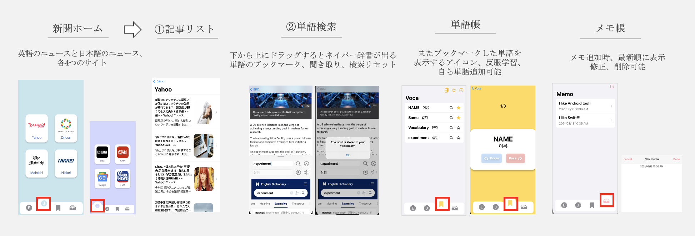
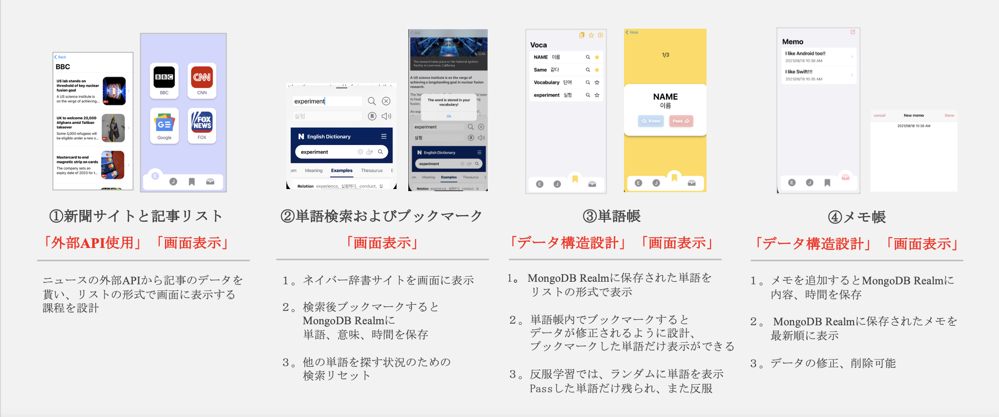

# HelloNews_iOSApp
<h3>📍「サービス紹介」</h3>
アメリカや日本のウェブサイト新聞を見、単語をブックマークし、単語帳を提供するIOSアプリケーション 
 
 
<h3>📍「企画背景」</h3>
ウェブ新聞を見ながらわからない単語があると他のサービスを開いて検索することが不便だという意見があり、 
解決できるサービスがあると人々がニュースを楽に見ることができると思ったからである。
 
 
<h3>📍「使用技術」</h3>
<ul style="font-size: 25px;">
  <li>DB : MongoDB Realm</li>
  <li>LANGUAGE : Swift</li>
  <li>ENVIRONMENT : Xcode</li>
  <li>API : ニュースAPI、カカオ翻訳API</li>
  <li>LIBRARY : SwiftUI, SwiftyJSON, SDWebImageSwiftUI, SlideOverCardなど</li>
</ul>
 
<h3>📍「開発期間/人数」</h3>
2021年6月21日～2021年7月27日 / 2人
 
 
<h3>📍「機能」</h3>
<ul style="font-size: 25px;">
  <li>記事リスト</li>
  <li>単語検索</li>
  <li>単語帳(単語帳のブックマーク、反服学習、自ら単語追加も可能）</li>
  <li>メモ帳</li>
</ul>
 
<h3>📍「サービスの詳細説明」</h3>

 
<h3>📍「担当した部分」</h3>
「Backend」 70% 「Frontend」 70%  

